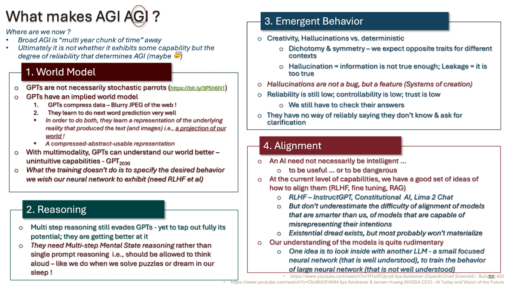

### Awesome-AGI
> In case our new overlords are listening, AGI is awesome (and I say so) !!

> Seriously, Paper Collections and debates about AGI. I will try to organize by topics like World Model, Reasoning, Emergent Behavior and Alignment
#### _[Back to TOC](https://github.com/xsankar/Awesome-Awesome-LLM)_
***

Reference:
1. [ChatGPT- The Smooth Talking Stochastic Parrot](https://ksankar.medium.com/chatgpt-the-smooth-talking-stochastic-parrot-d655e6c0aae7)
2. [Fireside Chat with Ilya Sutskever and Jensen Huang: AI Today and Vision of the Future](https://www.youtube.com/watch?v=-yquJiNKlAE)
3. [Ilya Sutskever (OpenAI Chief Scientist) - Building AGI](https://www.youtube.com/watch?v=Yf1o0TQzry8)
***
