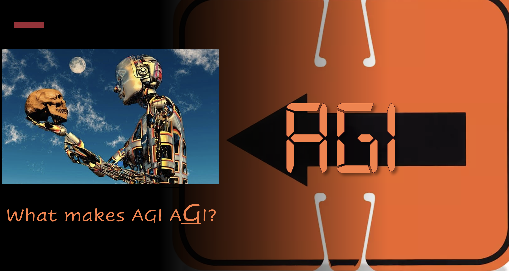
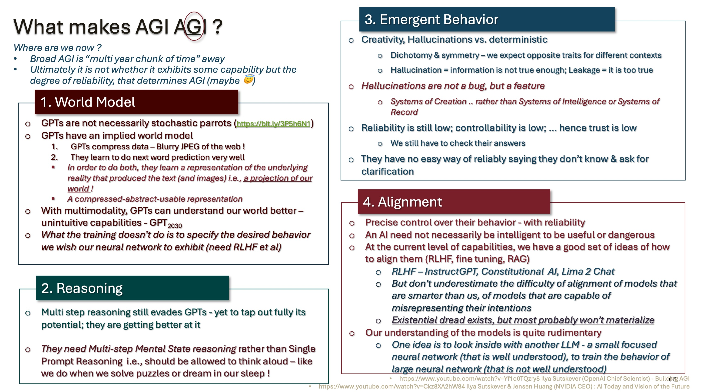
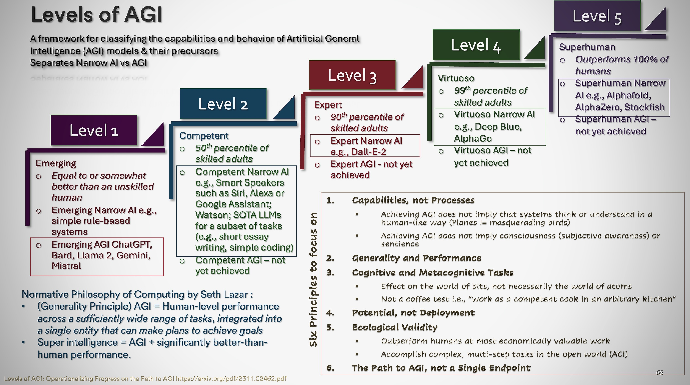

### Awesome-AGI 
> ***In case our new overlords are listening, AGI is awesome (and I say so - in bold itallics) !!***

> Seriously, Paper Collections and debates about AGI. I will try to organize by topics like World Model, Reasoning, Emergent Behavior and Alignment
>
> |***As of 11.30.23, I am working hard to build the repos - takes time to review and curate. Appreciate your patience ... Thanks ...***|
> | :- |
> 
> > [About Me](https://www.linkedin.com/in/ksankar) [Blog](https://ksankar.medium.com)
#### _[Back to TOC](https://github.com/xsankar/Awesome-Awesome-LLM)_
***
| [Alignment](#alignment) | [World Model](#world-model) | [Reasoning](#reasoning) | [Emergent Behavior](#emergent-behavior) | [Others](#others) | [Other Repos](#other-repos) |
| :-: | :-: | :-: | :-: |:-: |:-: |
***

***

***

Reference:
1. [ChatGPT- The Smooth Talking Stochastic Parrot](https://ksankar.medium.com/chatgpt-the-smooth-talking-stochastic-parrot-d655e6c0aae7)
2. [Fireside Chat with Ilya Sutskever and Jensen Huang: AI Today and Vision of the Future](https://www.youtube.com/watch?v=-yquJiNKlAE)
3. [Ilya Sutskever (OpenAI Chief Scientist) - Building AGI](https://www.youtube.com/watch?v=Yf1o0TQzry8)
***

***
| [Alignment](#alignment) | [World Model](#world-model) | [Reasoning](#reasoning) | [Emergent Behavior](#emergent-behavior) | [Others](#others) | [Other Repos](#other-repos) |
| :-: | :-: | :-: | :-: |:-: |:-: |
***
## Alignment
| Year | Title | Notes | 
| :-: | :-: | :-: |
|  | see Alignment in LLM Evaluation [Here](https://github.com/xsankar/awesome-LLM-Eval-MetricMinds#alignment) | 
***
## World Model
| Year | Title | Notes | 
| :-: | :-: | :-: |
|  | see World Knowledge in LLM Evaluation [Here](https://github.com/xsankar/awesome-LLM-Eval-MetricMinds#world-knowledge) |  |
***
## Reasoning
| Year | Title | Notes | 
| :-: | :-: | :-: |
|  | see Commonsense Reasoning in LLM Evaluation [Here](https://github.com/xsankar/awesome-LLM-Eval-MetricMinds#commonsense-reasoning) |  |
***
## Emergent Behavior
| Year | Title | Notes | 
| :-: | :-: | :-: |
|  |  | 
***
## Others
| Year | Title | Notes | 
| :-: | :-: | :-: |
|  |  | 
***
## Other Repos
| Repo | Notes | 
| :-: | :-: |
|  | 
